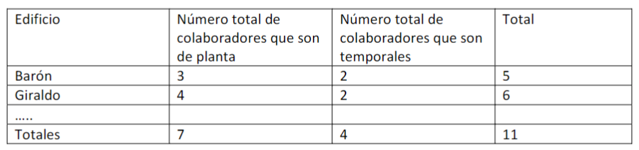

# Proyecto Bases

- Miguel Francisco Vargas Contreras
- Nicolas Diaz Granados Cano
- Sara Rodriguez Urueña

## Documentación

Este proyecto fue probado en MariaDB y Oracle Server.

### Creación de tablas

Se crearon dos archivos: `DDL.sql` y `DDL+drop.sql`, ambos destinados a la creación de tablas en la base de datos. La razón para usar dos archivos separados es permitir la limpieza previa de las tablas existentes. Si la base de datos no está vacía, el archivo `DDL+drop.sql` eliminará las tablas existentes antes de crear las nuevas.

El orden utilizado para la creación de las tablas es el siguiente:

1. **Edificio**
2. **Piso**
3. **Cafetería**
4. **Colaborador**
5. **Meta**

Este orden asegura que primero se creen las tablas sin relaciones, facilitando así la creación de las tablas que dependen de ellas. En el archivo `DDL+drop.sql`, las tablas se eliminarán en el orden inverso:

```sql
DROP TABLE meta;
DROP TABLE colaborador;
DROP TABLE cafeteria;
DROP TABLE piso;
DROP TABLE edificio;
```

#### Edificio

```sql
CREATE TABLE edificio (
  id          NUMBER GENERATED BY DEFAULT ON NULL AS IDENTITY,
  nombre      VARCHAR2(255),

  PRIMARY KEY (id)
);
```

#### Piso

```sql
CREATE TABLE piso (
  id          NUMBER GENERATED BY DEFAULT ON NULL AS IDENTITY,
  numeropiso  NUMBER,
  idEdificio  NUMBER,

  PRIMARY KEY (id),
  FOREIGN KEY (idEdificio) REFERENCES edificio (id)
    ON DELETE SET NULL
);
```

#### Cafetería

```sql
CREATE TABLE cafeteria (
  id          NUMBER GENERATED BY DEFAULT ON NULL AS IDENTITY,
  nombre      VARCHAR2(255),
  idPiso      NUMBER,

  PRIMARY KEY (id),
  FOREIGN KEY (idPiso) REFERENCES piso (id)
    ON DELETE SET NULL
);
```

#### Colaborador

```sql
CREATE TABLE colaborador (
  id              NUMBER GENERATED BY DEFAULT ON NULL AS IDENTITY,
  nombre          VARCHAR2(255),
  tipodocumento   VARCHAR2(255),
  numerodocumento NUMBER,
  vinculacion     VARCHAR2(255) 
    CHECK (vinculacion IN ('PLANTA', 'TEMPORAL')),
  comision        NUMBER DEFAULT 10
    CHECK (comision >= 0 AND comision <= 100),

  PRIMARY KEY (id)
);
```

De acuerdo con el enunciado del proyecto, la validación de la vinculación realizará una verificación para asegurar que el dato ingresado sea `'PLANTA'` o `'TEMPORAL'`.

```sql
CREATE TABLE meta (
  id            NUMBER GENERATED BY DEFAULT ON NULL AS IDENTITY,
  fechameta     NUMBER,
  valormeta     NUMBER DEFAULT 0,
  valorreal     NUMBER DEFAULT 0,
  idCafeteria   NUMBER,
  idColaborador NUMBER,

  PRIMARY KEY (id),
  FOREIGN KEY (idCafeteria) REFERENCES cafeteria (id)
    ON DELETE SET NULL,
  FOREIGN KEY (idColaborador) REFERENCES colaborador (id)
    ON DELETE SET NULL
);
```

### Creación de relaciones

Se utiliza la estructura `INSERT INTO tabla (nombre_datos...) VALUES (datos...)` porque el `id` se genera automáticamente por la base de datos. Por lo tanto, es necesario especificar los datos y el orden en que se van a insertar.

La inserción de los datos para la tabla `edificio` se realizó manualmente. Posteriormente, se utilizó [ChatGPT](https://chat.openai.com) para generar las inserciones para las tablas `piso`, `cafetería`, `meta` y `colaborador`. Esta última tabla requirió un [script](https://github.com/Achalogy/proj-bases-1/blob/main/utils/main.ts) en `TypeScript` para generar fechas aleatorias.

Estas instrucciones se guardan en el archivo `relationsInsertFile.sql`, que comienza eliminando todos los datos de cada tabla.

### Desarrollo de ejercicios

#### VISTA_1

> Listado de colaboradores, cafeterías y metas. Liste la cafetería, nombre del edificio, número del piso, nombre del colaborador, número y tipo de documento, fecha de meta, valor de las metas de ventas y valor real de ventas, diferencia porcentual entre meta y valor real. Ordene por fecha de meta, nombre de cafetería nombre de colaborador.

Se uso la definición de variación porcentual tomada de internet: _Se calcula restando el valor antiguo del nuevo y luego, se divide el valor obtenido sobre el valor absoluto antiguo y se multiplica por 100._

```sql
((meta.valormeta - meta.valorreal)/meta.valorreal) * 100 as variacionporcentual
```

Ya con esta formula tenemos todos los datos necesarios para la query.

```sql
SELECT  cafeteria.nombre, 
        edificio.nombre, 
        piso.numeropiso, 
        colaborador.nombre, 
        colaborador.tipodocumento, 
        colaborador.numerodocumento, 
        meta.fechameta, 
        meta.valormeta, 
        meta.valorreal, 
        ((meta.valormeta - meta.valorreal)/meta.valorreal) * 100 as variacionporcentual

FROM  cafeteria, 
      meta, 
      colaborador, 
      edificio, 
      piso
      
WHERE cafeteria.id=meta.idCafeteria
  AND colaborador.id=meta.idColaborador
  AND cafeteria.idPiso=piso.id
  AND piso.idEdificio=edificio.id

ORDER BY  meta.fechameta, 
          cafeteria.nombre, 
          colaborador.nombre;
```

#### VISTA_2

> Cuales son las ventas totales de cada cafetería?, liste el nombre de la cafetería, total de ventas. Las cafeterías que no tienen ventas deben aparecer en el listado.

Para cambiar el valor `NULL` de las cafeterías sin ventas a `0`, utilizamos la función `COALESCE(SUM(meta.valormeta), 0)`. Esta función calcula la suma de ventas y reemplaza los valores `NULL` por `0`.

Además, empleamos un `LEFT JOIN` (⋈) para combinar los datos de ventas (de la tabla `meta`) con cada cafetería, uniendo las tablas mediante `cafeteria.id = meta.idcafeteria`.


```sql
SELECT  cafeteria.nombre, 
        COALESCE(SUM(meta.valorreal), 0) AS ventas
  
FROM cafeteria

LEFT JOIN meta ON cafeteria.id = meta.idcafeteria

GROUP BY  cafeteria.id;
``` 

#### VISTA_3

> Cuál es el valor por pagar a cada colaborador en cada mes y año? Liste el nombre del colaborador, el valor a pagar (total de ventas multiplicado por la comisión del colaborador). En una última fila muestre el total general de todos los colaboradores. 

Conseguimos el valor `anho_mes` eliminando el valor del día en la tupla de la fecha. Para ello, dividimos en 100 y descartamos los decimales usando `ROUND()`. Luego, aplicamos la fórmula para calcular el monto a pagar al colaborador y utilizamos nuevamente `COALESCE` para evitar valores nulos.

Guardamos esta primera consulta con el nombre de `pagos`. Esta tabla contendrá información del colaborador, como el nombre, su comisión, las ventas y el pago a realizar, además de la fecha en formato _añomes_.

A continuación, crearemos la tabla `total`, que solo tendrá una fila con el nombre `"TOTAL"`. Mantendremos el valor del pago y cambiamos todos los demás valores por `NULL`.

Finalmente, uniremos la tabla `pagos` con la tabla generada y realizaremos un `SUM(pago)` para encontrar el total de los pagos de todos los colaboradores.

```sql
WITH pagos AS (
  SELECT colaborador.nombre, ROUND(fechameta/100) as anho_mes,
        COALESCE(SUM(meta.valorreal),0) AS ventas,
        colaborador.comision,
        COALESCE(ROUND(SUM(meta.valorreal) * ( colaborador.comision / 100 )), 0) AS pago
  FROM meta

  LEFT JOIN colaborador ON colaborador.id = meta.idColaborador

  GROUP BY anho_mes

  ORDER BY colaborador.nombre
),

total AS (
  SELECT "TOTAL" as nombre, null as anho_mes, null as ventas, null as comision, pago from pagos
)

SELECT * FROM pagos

UNION ALL

SELECT nombre, anho_mes, ventas, comision, SUM(pago) as pago from total;
```

#### VISTA_4

> Cuál es el valor de las metas y ventas reales por cada año y mes? Liste año, mes y suma total de las metas, suma total de valores reales y suma total de la diferencia entre el valor real y la meta en ese año – mes.

Usaremos nuevamente `ROUND()` para calcular el _añomes_, haremos la suma, y utilizaremos `COALESCE()` para evitar valores `NULL`. Agruparemos los resultados por `anho_mes` y los organizaremos. A esta tabla le llamaremos `ventas`.

Sobre esta tabla, agregaremos una nueva fila que contenga la diferencia entre el valor real y la meta.

```sql
WITH ventas AS (
  SELECT  ROUND(fechameta/100) AS anho_mes,
          COALESCE(SUM(meta.valormeta),0) AS metas,
          COALESCE(SUM(meta.valorreal),0) AS reales

  FROM meta

  GROUP BY anho_mes

  ORDER BY anho_mes
) 
SELECT *, (metas - reales) AS diferencia 
FROM ventas;
```

#### VISTA_5

> Cuál es el porcentaje de participación de cada colaborador en el total general? El porcentaje de participación se calcula como la suma total de ventas reales de cada colaborador sobre la suma total de metas en todas las cafeterías. Liste el nombre del colaborador, total de ventas reales y el porcentaje de participación sobre las ventas reales de los colaboradores. 

Crearemos una tabla llamada `ventasColaborador` donde se almacenarán la suma de las ventas, la cantidad de ventas de los colaboradores y su nombre. Con esta tabla, crearemos otra que contendrá una única fila con el total de ventas de todos los colaboradores.

Luego, cruzaremos estas tablas de tal manera que cada colaborador tenga una fila con el total de ventas de todos los colaboradores. Utilizaremos esta información para aplicar la fórmula `(ventas * 100 / total)`, que nos dará el porcentaje de participación en las ventas.


```sql
WITH ventasColaborador AS (
  SELECT colaborador.nombre,
        COALESCE(SUM(meta.valorreal),0) AS ventas,
        COALESCE(COUNT(meta.valorreal),0) AS cantidadVentas
  FROM meta

  LEFT JOIN colaborador ON colaborador.id = meta.idColaborador

  GROUP BY colaborador.nombre

  ORDER BY colaborador.nombre
),
total as (
  SELECT SUM(meta.valorreal) as total 
  FROM meta
) 
SELECT  nombre, 
        cantidadVentas, 
        ventas, 
        (ventas * 100 / total) as porcentajeParticipacion 
FROM ventasColaborador, total;
```

#### VISTA_6

> Qué colaborador tiene metas en todas las cafeterías? Liste el nombre del colaborador.

Con todas las metas, proyectaremos solo el nombre del colaborador y el ID de la cafetería en la que realizó cada venta. Seleccionaremos solo los valores distintos, lo que nos dará una tabla que indicará en qué cafeterías vendió cada empleado. A esta relación la llamaremos `colabCafeterias`.

Luego, crearemos una relación llamada `cantCafeterias` que contendrá únicamente la cantidad total de cafeterías.

A continuación, crearemos una relación llamada `filtro`, en la cual aplicaremos `COUNT()` sobre el ID de cafeterías para contar en cuántas cafeterías vendió cada ID de colaborador.

Finalmente, cruzaremos estas dos tablas para filtrar los colaboradores que hayan vendido en el mismo número de cafeterías diferentes que la cantidad total de cafeterías.


```sql
WITH colabCafeterias AS (
  SELECT DISTINCT nombre, 
                  idCafeteria 
  FROM colaborador
  LEFT JOIN meta ON meta.idColaborador=colaborador.id
),
cantCafeterias AS (
  SELECT COUNT(id) as cantidad
  FROM cafeteria
),
filtro AS (
  SELECT nombre, COUNT(idCafeteria) AS cafeteriasColaborador, cantidad
  FROM colabCafeterias, cantCafeterias
  GROUP BY nombre
) 
SELECT nombre as colaboradorEnTodasLasCafeterias
FROM filtro
WHERE cafeteriasColaborador=cantidad;
```

#### VISTA_7



Se realiza un `SELECT DISTINCT` de todas las tablas de la base de datos para relacionar cada trabajador con los edificios en los que ha realizado una venta. Este proceso consiste en revisar las ventas de cada trabajador, recorrer toda la base de datos para identificar el nombre del edificio y seleccionar los valores distintos.

Con esta tabla, se crean dos relaciones diferentes, donde se almacena el nombre del trabajador, su vinculación y el ID del edificio. Las tablas se filtran buscando aquellos registros correspondientes a "PLANTA" y "TEMPORAL", respectivamente. Luego, se cuenta la cantidad de trabajadores, agrupándolos por edificio. Esto da lugar a dos tablas: una con los trabajadores de planta en cada edificio y otra con los trabajadores temporales en cada edificio.

Finalmente, estas dos tablas se unen en base al ID del edificio, se seleccionan los valores especificados en el enunciado del ejercicio y se añade una columna que muestra el total de trabajadores en cada edificio.

```sql
WITH trabajadoresEdifio as (
  SELECT DISTINCT colaborador.id as colabId, meta.idCafeteria, colaborador.vinculacion, edificio.nombre, edificio.id as edificioId
  FROM  meta, 
        colaborador,
        cafeteria,
        piso,
        edificio
  WHERE meta.idColaborador=colaborador.id
        AND meta.idCafeteria = cafeteria.id
        AND cafeteria.idPiso = piso.id
        AND piso.idEdificio = edificio.id
),
trabajadoresPlanta AS (
  SELECT  nombre, 
          COUNT(vinculacion) as cantidadPlanta,
          edificioId
  FROM trabajadoresEdifio
  WHERE vinculacion="PLANTA"
  GROUP BY nombre
),
trabajadoresTemporales AS (
  SELECT  nombre, 
          COUNT(vinculacion) as cantidadTemporal,
          edificioId
  FROM trabajadoresEdifio
  WHERE vinculacion="TEMPORAL"
  GROUP BY nombre
) 
SELECT  trabajadoresPlanta.nombre, 
        cantidadPlanta, 
        cantidadTemporal, 
        cantidadPlanta + cantidadTemporal AS total
FROM  trabajadoresPlanta,
      trabajadoresTemporales
WHERE trabajadoresPlanta.edificioId=trabajadoresTemporales.edificioId;
```