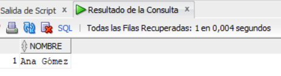

# Proyecto Bases

- Miguel Francisco Vargas Contreras
- Nicolas Diaz Granados Cano
- Sara Rodriguez Urueña

## Documentación

Este proyecto fue probado en MariaDB y Oracle Server.

### Creación de tablas

Se crearon dos archivos: `DDL.sql` y `DDL+drop.sql`, ambos destinados a la creación de tablas en la base de datos. La razón para usar dos archivos separados es permitir la limpieza previa de las tablas existentes. Si la base de datos no está vacía, el archivo `DDL+drop.sql` eliminará las tablas existentes antes de crear las nuevas.

El orden utilizado para la creación de las tablas es el siguiente:

1. **Edificio**
2. **Piso**
3. **Cafetería**
4. **Colaborador**
5. **Meta**

Este orden asegura que primero se creen las tablas sin relaciones, facilitando así la creación de las tablas que dependen de ellas. En el archivo `DDL+drop.sql`, las tablas se eliminarán en el orden inverso:

```sql
DROP TABLE meta;
DROP TABLE colaborador;
DROP TABLE cafeteria;
DROP TABLE piso;
DROP TABLE edificio;
```

#### Edificio

```sql
CREATE TABLE edificio (
  id          NUMBER GENERATED BY DEFAULT ON NULL AS IDENTITY,
  nombre      VARCHAR2(255) NOT NULL,

  PRIMARY KEY (id)
);
```

#### Piso

```sql
CREATE TABLE piso (
  id          NUMBER GENERATED BY DEFAULT ON NULL AS IDENTITY,
  numeropiso  NUMBER NOT NULL,
  idEdificio  NUMBER NOT NULL,

  PRIMARY KEY (id),
  FOREIGN KEY (idEdificio) REFERENCES edificio (id)
    ON DELETE SET NULL
);
```

#### Cafetería

```sql
CREATE TABLE cafeteria (
  id          NUMBER GENERATED BY DEFAULT ON NULL AS IDENTITY,
  nombre      VARCHAR2(255) NOT NULL,
  idPiso      NUMBER NOT NULL,

  PRIMARY KEY (id),
  FOREIGN KEY (idPiso) REFERENCES piso (id)
    ON DELETE SET NULL
);
```

#### Colaborador

```sql
CREATE TABLE colaborador (
  id              NUMBER GENERATED BY DEFAULT ON NULL AS IDENTITY,
  nombre          VARCHAR2(255) NOT NULL,
  tipodocumento   VARCHAR2(255) NOT NULL,
  numerodocumento NUMBER NOT NULL,
  vinculacion     VARCHAR2(255) NOT NULL 
    CHECK (vinculacion IN ('PLANTA', 'TEMPORAL')),
  comision        NUMBER DEFAULT 10 NOT NULL
    CHECK (comision >= 0 AND comision <= 100),

  PRIMARY KEY (id)
);
```

De acuerdo con el enunciado del proyecto, la validación de la vinculación realizará una verificación para asegurar que el dato ingresado sea `'PLANTA'` o `'TEMPORAL'`.

```sql
CREATE TABLE meta (
  id            NUMBER GENERATED BY DEFAULT ON NULL AS IDENTITY,
  fechameta     NUMBER NOT NULL,
  valormeta     NUMBER DEFAULT 0 NOT NULL,
  valorreal     NUMBER DEFAULT 0 NOT NULL,
  idCafeteria   NUMBER NOT NULL,
  idColaborador NUMBER NOT NULL,

  PRIMARY KEY (id),
  FOREIGN KEY (idCafeteria) REFERENCES cafeteria (id)
    ON DELETE SET NULL,
  FOREIGN KEY (idColaborador) REFERENCES colaborador (id)
    ON DELETE SET NULL
);
```

Usamos `NOT NULL` para evitar la inserción de valores nulos.

### Creación de relaciones

Se utiliza la estructura `INSERT INTO tabla (nombre_datos...) VALUES (datos...)` porque el `id` se genera automáticamente por la base de datos. Por lo tanto, es necesario especificar los datos y el orden en que se van a insertar.

La inserción de los datos para la tabla `edificio` se realizó manualmente. Posteriormente, se utilizó [ChatGPT](https://chat.openai.com) para generar las inserciones para las tablas `piso`, `cafetería`, `meta` y `colaborador`. Esta última tabla requirió un [script](https://github.com/Achalogy/proj-bases-1/blob/main/utils/main.ts) en `TypeScript` para generar fechas aleatorias.

Estas instrucciones se guardan en el archivo `relationsInsertFile.sql`, que comienza eliminando todos los datos de cada tabla.

### Desarrollo de ejercicios

#### VISTA_1

> Listado de colaboradores, cafeterías y metas. Liste la cafetería, nombre del edificio, número del piso, nombre del colaborador, número y tipo de documento, fecha de meta, valor de las metas de ventas y valor real de ventas, diferencia porcentual entre meta y valor real. Ordene por fecha de meta, nombre de cafetería nombre de colaborador.

Se uso la definición de variación porcentual tomada de internet: _Se calcula restando el valor antiguo del nuevo y luego, se divide el valor obtenido sobre el valor absoluto antiguo y se multiplica por 100._

```sql
((meta.valormeta - meta.valorreal)/meta.valorreal) * 100 as variacionporcentual
```

Ya con esta formula tenemos todos los datos necesarios para la query.

```sql
SELECT  cafeteria.nombre AS nombreCafeteria, 
        edificio.nombre AS nombreEdificio, 
        piso.numeropiso, 
        colaborador.nombre, 
        colaborador.tipodocumento, 
        colaborador.numerodocumento, 
        meta.fechameta, 
        meta.valormeta, 
        meta.valorreal, 
        ((meta.valormeta - meta.valorreal)/meta.valorreal) * 100 as variacionporcentual

FROM  cafeteria, 
      meta, 
      colaborador, 
      edificio, 
      piso
      
WHERE cafeteria.id=meta.idCafeteria
  AND colaborador.id=meta.idColaborador
  AND cafeteria.idPiso=piso.id
  AND piso.idEdificio=edificio.id

ORDER BY  meta.fechameta, 
          cafeteria.nombre, 
          colaborador.nombre;
```


#### VISTA_2

> Cuales son las ventas totales de cada cafetería?, liste el nombre de la cafetería, total de ventas. Las cafeterías que no tienen ventas deben aparecer en el listado.

Para cambiar el valor `NULL` de las cafeterías sin ventas a `0`, utilizamos la función `COALESCE(SUM(meta.valormeta), 0)`. Esta función calcula la suma de ventas y reemplaza los valores `NULL` por `0`.

Además, usaremos producto cartesiano para combinar los datos de ventas (de la tabla `meta`) con cada cafetería, uniendo las tablas mediante `cafeteria.id = meta.idcafeteria`. Se ordena para una mejor lectura.


```sql
SELECT  cafeteria.id, cafeteria.nombre, 
        COALESCE(SUM(meta.valormeta), 0) AS ventas
FROM cafeteria, meta
WHERE cafeteria.id = meta.idcafeteria
GROUP BY cafeteria.id, cafeteria.nombre
ORDER BY cafeteria.id;
``` 


#### VISTA_3

> Cuál es el valor por pagar a cada colaborador en cada mes y año? Liste el nombre del colaborador, el valor a pagar (total de ventas multiplicado por la comisión del colaborador). En una última fila muestre el total general de todos los colaboradores. 

Conseguimos el valor `anhoMes` eliminando el valor del día en la tupla de la fecha. Para ello, dividimos en 100 y descartamos los decimales usando `ROUND()`. Luego, aplicamos la fórmula para calcular el monto a pagar al colaborador.

Guardamos esta primera consulta con el nombre de `pagos`. Esta tabla contendrá información del colaborador, como el nombre, su comisión, las ventas y el pago a realizar, además de la fecha en formato _añomes_.

Finalmente, uniremos la tabla `pagos` con una nueva query realizando un `SUM(pago)` para encontrar el total de los pagos de todos los colaboradores basandonos en otra query que solo tendrá una fila con el nombre `'TOTAL'`. Mantendremos el valor del pago y cambiamos todos los demás valores por `NULL`, Luego .

```sql
WITH pagos AS (
    SELECT  nombre,
            anhoMes, 
            sum(valormeta) AS ventas,
            comision,
            ROUND(SUM(valormeta) * ( comision / 100 )) AS pago
    FROM colaborador, (
            SELECT  idcolaborador, 
                    ROUND(fechameta/100) as anhoMes, 
                    valormeta
            FROM meta
    ) m
    WHERE colaborador.id = idcolaborador
    GROUP BY anhoMes, nombre, comision
    ORDER BY nombre, comision
)

SELECT * FROM pagos

UNION ALL

SELECT  nombre, 
        anho_mes, 
        ventas, 
        comision, 
        SUM(pago) as pago 
FROM (
    SELECT  'TOTAL' as nombre, 
            null as anho_mes, 
            null as ventas, 
            null as comision, 
            pago from pagos
);
```


#### VISTA_4

> Cuál es el valor de las metas y ventas reales por cada año y mes? Liste año, mes y suma total de las metas, suma total de valores reales y suma total de la diferencia entre el valor real y la meta en ese año – mes.

Seleccionaremos `anhoMes`, `valorreal` y `valormeta` desde una query en la que usaremos nuevamente `ROUND()` para calcular el _añomes_ y haremos la suma de los `valormeta` y `valorreal` este lo agruparemos por `anhoMes` y los organizaremos. Sobre esta tabla, agregaremos una nueva fila que contenga la diferencia entre las sumas de valor real y las sumas de valor meta.

```sql
SELECT  anhoMes, 
        sum(valorreal) as ventas, 
        sum(valormeta) as metas,
        sum(valormeta) - sum(valorreal) as diferencia
FROM (
            SELECT  ROUND(fechameta/100) as anhoMes, 
                    valorreal,
                    valormeta
            FROM meta
    ) m
GROUP BY anhoMes
ORDER BY anhoMes;
```


#### VISTA_5

> Cuál es el porcentaje de participación de cada colaborador en el total general? El porcentaje de participación se calcula como la suma total de ventas reales de cada colaborador sobre la suma total de metas en todas las cafeterías. Liste el nombre del colaborador, total de ventas reales y el porcentaje de participación sobre las ventas reales de los colaboradores. 

Se calcula la suma total de las ventas, sumando todos los `valorreal` de todas las metas mediante una subconsulta que se asocia como la tabla `m`. Unimos esta subconsulta con las tablas `colaborador` y `meta`, agrupamos por el nombre del colaborador, lo que nos permite conseguir la suma de todas las ventas de cada colaborador y mantener el total de todas las metas. Calculamos el porcentaje de participación de cada colaborador en las ventas totales dividiendo sus ventas por el total de ventas y multiplicándolo por 100, y mostramos esta información junto con el nombre del colaborador y sus ventas totales.

```sql
SELECT  nombre, 
        total, 
        sum(valorreal) as ventas, 
        (sum(valorreal) * 100 / total) as porcentajeParticipacion 
FROM colaborador, meta, (
    SELECT sum(valorreal) as total
    FROM meta
) m
WHERE idColaborador = colaborador.id
GROUP BY nombre, total;
```


#### VISTA_6

> Qué colaborador tiene metas en todas las cafeterías? Liste el nombre del colaborador.

Uniendo las siguientes queries:
- **cantcafeterias:** Contar la cantidad de cafeterias
- **colab:** Producto cartesiano entre colaborador y meta, filtrando para que queden las ventas de cada colaborador, de este solo proyectaremos el nombre, el id del colaborador y el id de la cafeteria, así seleccionando solo los distintos, tendremos una lista de cada cafeteria y cada trabajador que trabajo en ella.
Con estas dos queries agruparemos por trabajador y cafeteria, así al contar la cantidad de `idCafeteria` nos dara como resultado la cantidad de cafeterias en las que trabajo cada colaborador y mantendremos `ccafeterias` donde guardamos el total de cafeterias.

Ahora sobre esa query con las cantidades, filtraremos solo los colaboradores que tengan la misma cantidad de cafeterias en las que trabajaron y la cantidad total de cafeterias en la universidad, de esta solo proyectaremos el nombre de los colaboradores que cumplan.

```sql
SELECT nombre
FROM (
    SELECT DISTINCT nombre, 
                count(idCafeteria) as trabajaEn,
                ccafeterias
    FROM (
        SELECT COUNT(cafeteria.id) as ccafeterias
        FROM cafeteria
    ) cantcafeterias, (
        SELECT DISTINCT nombre, colaborador.id, idCafeteria
        FROM colaborador, meta
        WHERE meta.idColaborador=colaborador.id
    ) colab
    GROUP BY nombre, ccafeterias
)
WHERE trabajaen=ccafeterias;
```



#### VISTA_7


